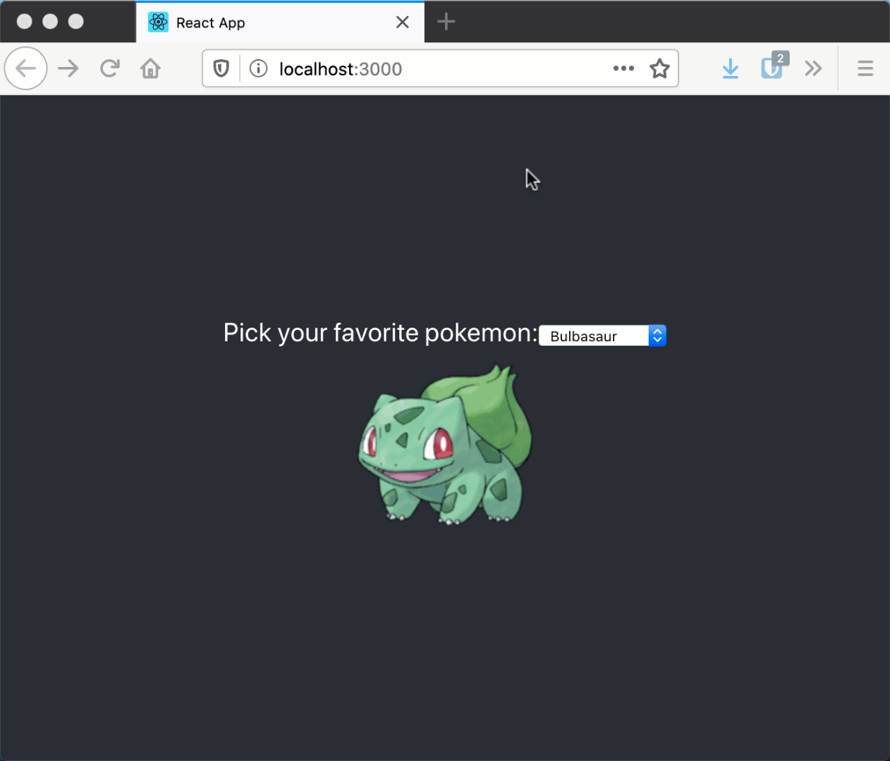

# starter-chooser
Travail sur les forms dans React

# But
Vous devez créé une application React qui va contenir une liste déroulante et ensuite faire apparaitre

# Élément fourni
* Squelette des components [App.js](src/App.js), [StarterSelector.js](src/StarterSelector.js), [StarterShower.js](src/StarterShower.js)

# Requis technique
* Le state doit être geré au dessus des deux components.
* Les deux components ne doivent pas être imbriqués l'un dans l'autre (doivent rester dans `App`).

# Indice
Vous devez passer la fonction setState et state du useState comme props pour permettre à un component enfant de recevoir la fonction et la valeur.

# Exemple du projet
